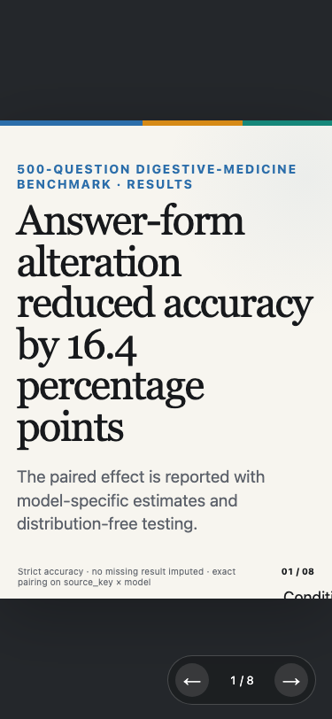
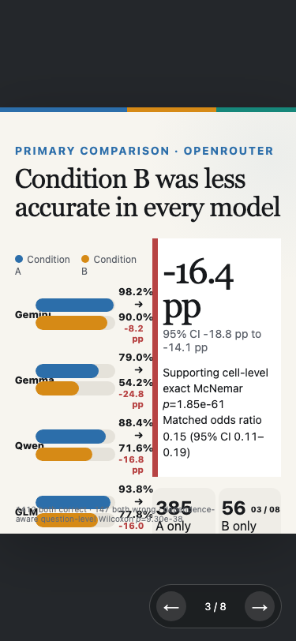
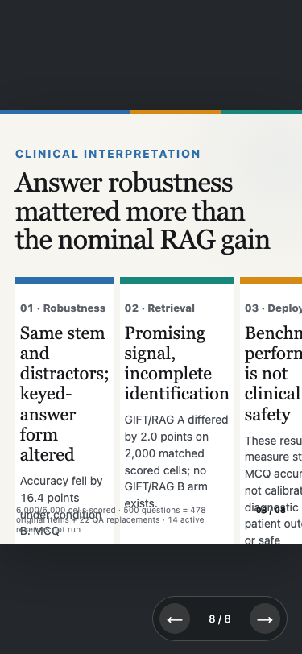
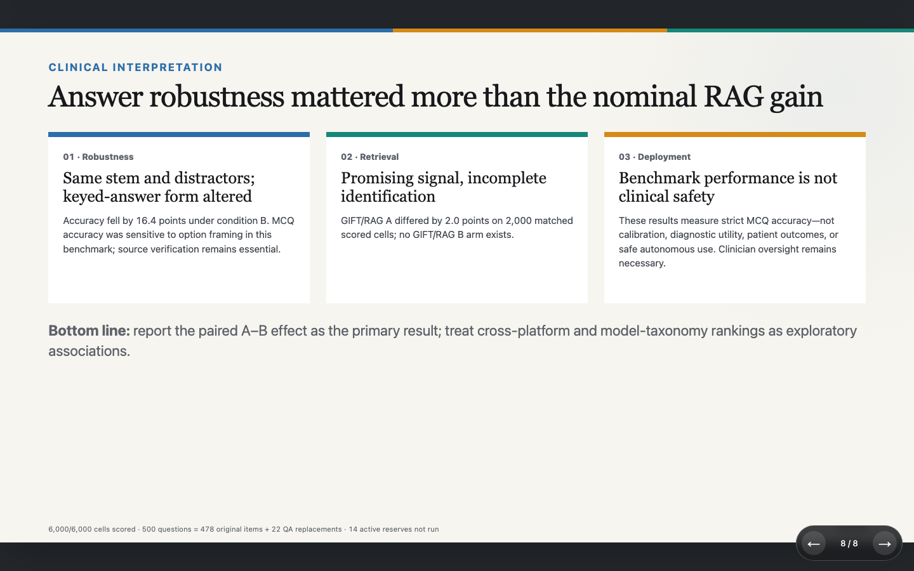

# QA Report: AB520 adjusted-results presentation

| Field | Value |
|-------|-------|
| **Date** | 2026-08-05 |
| **URL** | `http://127.0.0.1:51354/presentation/benchmark-results-presentation.html` |
| **Scope** | All eight slides, forward/back navigation, console/network health, desktop and mobile rendering |
| **Mode** | full |
| **Duration** | 13 minutes |
| **Pages visited** | 1 page / 8 slide states |
| **Screenshots** | 28 |
| **Framework** | Static HTML/JavaScript slide deck |

## Health Score: 99/100

| Category | Score |
|----------|-------|
| Console | 100 |
| Links | 100 |
| Visual | 92 |
| Functional | 100 |
| UX | 100 |
| Performance | 100 |
| Content | 100 |
| Accessibility | 100 |

Weighted score: 99.2, rounded to 99.

## Top Things to Fix

1. **ISSUE-001: Mobile slide content is clipped** — At 375×812, the fixed presentation canvas does not fit several slides, hiding tables, chart annotations, footnotes, and portions of slide 8's third column.
2. No second issue was found.
3. No third issue was found.

## Console Health

No console errors occurred while loading the deck, traversing all eight slides, returning from slide 8 to slide 7, or changing viewport size.

The page loaded with one successful HTTP 200 request (48,800 bytes; observed response time 1–7 ms). The deck contains no outbound links or forms.

## Functional and Accessibility Checks

- Right-arrow navigation reached all eight slide states; left-arrow navigation returned from slide 8 to slide 7.
- The previous and next controls are exposed as named buttons (`Previous slide` and `Next slide`).
- Keyboard navigation worked, and no failed network requests appeared.
- Every slide rendered cleanly at 1440×900 after its transition settled.
- The figures and reported counts agreed with the regenerated data artifacts during the separate data-integrity QA.

## Summary

| Severity | Count |
|----------|-------|
| Critical | 0 |
| High | 0 |
| Medium | 1 |
| Low | 0 |
| **Total** | **1** |

## Issues

### ISSUE-001: Mobile slide content is clipped

| Field | Value |
|-------|-------|
| **Severity** | medium |
| **Category** | visual |
| **URL** | `http://127.0.0.1:51354/presentation/benchmark-results-presentation.html` |

**Description:** The desktop 16:9 presentation is complete and legible, but the 375×812 viewport does not scale or reflow the full slide. Slides 1–8 show varying degrees of horizontal or vertical clipping. Core data remain present in the source presentation, but a mobile viewer cannot read all of them without a desktop-width viewport.

**Repro Steps:**

1. Navigate to the presentation and set the viewport to 375×812.
   
2. Press the right arrow through the deck.
   
3. Observe clipped tables, chart annotations, footnotes, and the third interpretation card.
   

**Expected:** Each slide should scale to the viewport or provide an intentional pan/zoom affordance that keeps every element reachable.

**Actual:** The fixed canvas overflows the mobile viewport and the bottom navigation region obscures some content.

Desktop reference: 

